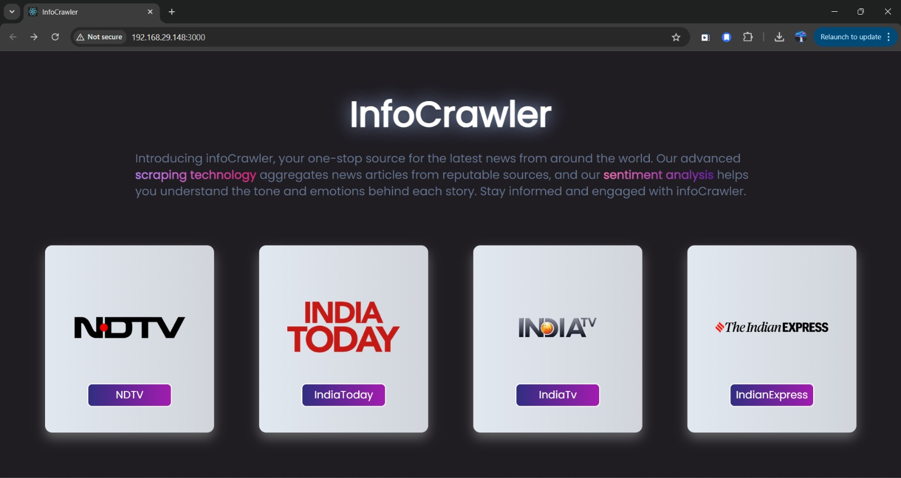

# InfoCrawler



## Overview

InfoCrawler is a comprehensive web scraping solution that aggregates reputable news articles, performs sentiment analysis, and employs Natural Language Processing (NLP) algorithms to provide insightful information. The project includes an interactive React-based user interface for seamless exploration and a FastAPI backend for efficient processing and integration with the frontend.

## Features

- **Web Scraping:** Utilizes BeautifulSoup to scrape news articles from various reputable sources.
- **Sentiment Analysis:** Applies sentiment analysis to provide insights into the overall tone of the articles.
- **NLP Algorithms:** Leverages NLP techniques to extract key information and insights from the articles.
- **Interactive UI:** Developed with React for a user-friendly and interactive experience.
- **FastAPI Backend:** Ensures efficient data processing and seamless integration between the frontend and backend.

## Project Structure

The project is organized into two main directories:
- `client`: Contains the React application.
- `server`: Contains the FastAPI server and web scraping scripts.

## Installation

### Prerequisites

- Node.js and npm
- Python 3.9
- Virtual environment (optional but recommended)

### Clone the Repository

```bash
git clone https://github.com/bajajdivya/infocrawlerr.git
cd infocrawlerr
```

## Setting Up the Server

1. Navigate to the server directory:
    ```bash
    cd server
    ```

2. Install the required Python packages:
    ```bash
    pip install -r requirements.txt
    ```

3. Start the FastAPI server:
    ```bash
    python main.py
    ```

### Setting Up the Client

1. Navigate to the client directory:
    ```bash
    cd ../client
    ```

2. Install the required npm packages:
    ```bash
    npm install
    ```

3. Start the React application:
    ```bash
    npm start
    ```

## Usage

1. Ensure the FastAPI server is running:
    ```bash
    python server/main.py
    ```

2. Start the React application in the client directory:
    ```bash
    npm start
    ```

3. Open your web browser and navigate to `http://localhost:3000` to explore the interactive UI.

## Screenshots

### Main Page


### Real Time Scraped News from NDTV


### Real Time Scraped News from India Today


## Contributing

Contributions are welcome! Please open an issue or submit a pull request for any improvements or new features.

## License

This project is licensed under the MIT License.

## Acknowledgments

- [BeautifulSoup](https://www.crummy.com/software/BeautifulSoup/) for web scraping.
- [FastAPI](https://fastapi.tiangolo.com/) for the backend framework.
- [React](https://reactjs.org/) for the frontend framework.
